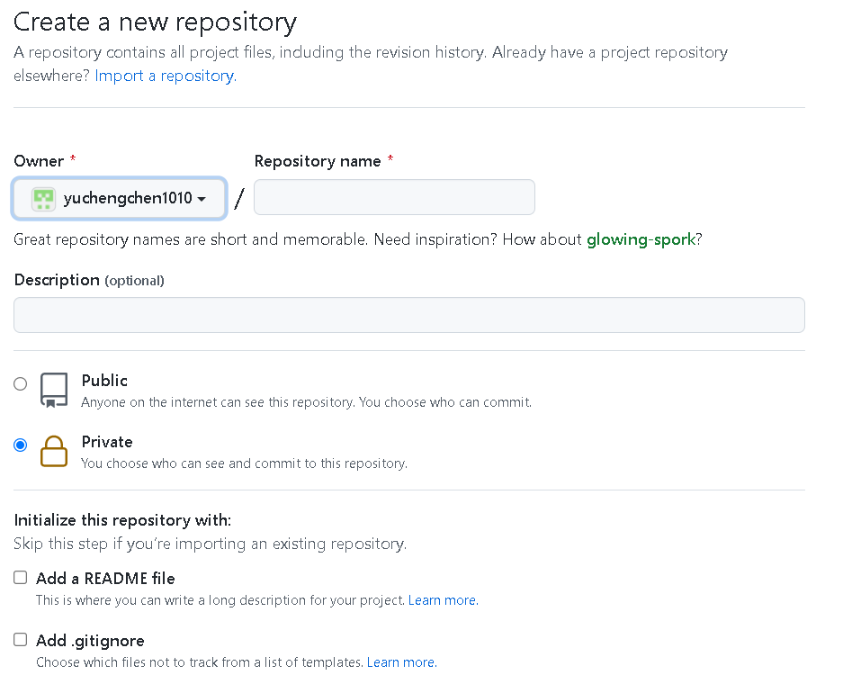
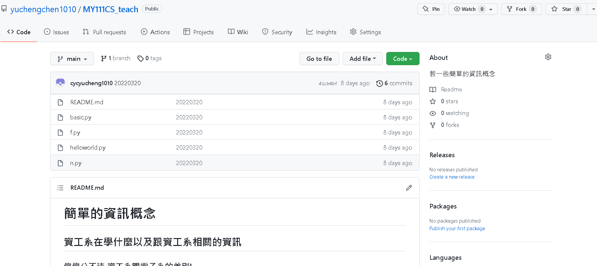

<style>
    :root{
        --color-background: #101010;
        --color-foreground: #FFFFFF;
    }
</style>

# 簡單的資訊概念
---
## 資工系在學什麼以及跟資工系相關的資訊
---
### 傻傻分不清 資工系跟電子系的差別!
---
### 以金大資工系110課程地圖為例!
https://www.nqu.edu.tw/upload/educsie/attachment/7bd46226466421d3fa03f8967200ced3.pdf

---
### 接下來來看看電子系!
https://www.nqu.edu.tw/upload/eduee/attachment/4e316029fc1cfaf7e5f4093d35756f0f.pdf

---
### 因此兩者實際上關聯度不高，選科系前要想清楚!
---
### 基本上資工系可以分為四大領域
1. 硬體
    * 數位邏輯 ----> 計算機結構
    * 簡單來說就是如何設計一台電腦的硬體
    * Arduino、resberry，透過電路以及程式操作電子元件
2. 軟體
    * 軟體 = 資料結構 + 演算法
    * 作業系統、APP、人工智慧 基本上都可以算在這個領域
---
### 基本上資工系可以分為四大領域
3. 韌體
    * 簡單來說就是BIOS
4. 網路
    * 網路管理
    * 網站前端後端
---
### 簡單來說資工主要可分為幾個面向:
* 電子元件操作
* 軟韌體開發
* 網站設計
* 網路與資訊安全
* 資料科學與人工智慧
---
### 而資工系出路
* 電腦軟體服務業
* 網際網路相關業
* IC設計相關產業
* 半導體製造業
---
### 常見的程式語言


---
### 說了這麼多一頭霧水，因此先從一些基本的東西開始吧!
---
## 虛擬機和linux
---
### 虛擬機簡單來說就是在電腦中在弄出一個電腦
* 但電腦設備不能太爛不然會跑不動
* 建議電腦規格如下:
   * RAM:8GB
   * CPU:至少4核心以上
   * 硬碟建議使用:SSD 50GB
---
### virtual box 


---

>選擇windows hosts 下載完後安裝
---


---


---
### linux 是什麼
* 白話文來說就是寫程式的人在用的作業系統
* 有很多種類，這邊使用的是ubuntu 20.04LTS
---

### 開始安裝


---


---


---


---


---


---

## Github基礎使用
### 安裝vscode
https://code.visualstudio.com/download
### 註冊
https://medium.com/@chaowu.dev/%E5%89%9B%E5%AD%B8%E7%BF%92%E7%A8%8B%E5%BC%8F%E8%AA%9E%E8%A8%80%E4%BD%86%E9%82%84%E6%B2%92%E6%9C%89%E4%B8%80%E7%B5%84%E8%87%AA%E5%B7%B1%E7%9A%84-github-%E5%B8%B3%E8%99%9F%E5%97%8E-e05c16113411

---
### 建立一個repository

---
### 在網頁上操作github

---
### [學習如何fork](https://github.com/yuchengchen1010/MY111CS_teach)

---
### 在電腦上操作git

---
## Markdown的介紹及指令和實際操作
* [介紹&指令](https://markdown.tw/)
* [利用markdown做ppt](https://github.com/cycyucheng1010/NQU/tree/main/Make%20Presentations%20with%20Markdown%20in%20VSCode)
* [利用markdown畫圖表](https://github.com/cycyucheng1010/NQU/blob/main/Mermaid_cahrt/draw_chart.md)
* [利用markdown做網頁](https://yuchengchen1010.github.io/)

---
## python簡單應用
https://www.runoob.com/python/python-tutorial.html
* ```print('helloworld')```
* 費式數列
* 階層
* import
* pip install
    * https://pypi.org/project/pip/
--- 
## Q&A
* 前後端程式?
   * 前端
       * 前端基礎: html+css+javascript
       * 進階前端: angularjs、reactjs、vuejs、flutter
   * 後端
      * PHP、Ruby、Python、Node.js、Golang 
---
## Q&A
* 高中的課業跟大學課程(資工系)的相關性?
   * 沒有直接相關，但數理能力能夠幫助你更快學習。
   * 因此就算學測考不到台清交成的資工，也不用覺得人生已經結束了。
---
## Q&A
* 什麼語言最好最牛逼?
   * 沒有甚麼程式語言是最好用的，每個都有優缺點。
   * 但如果只挑一種的話我推薦python
      * 簡單、泛用。
---
## Q&A
* 有甚麼想問的可以現在問，知無不言!
---
## 結語
* 學習程式從什麼時候開始都可以，不一定要等到上大學。
* 寫程式也不一定要從頭自幹到尾，適時的站在巨人的肩膀上，完成自己的目標。
* 學會善用網路資源，進行自我學習。
* 不一定要念資工系，先評估自己是否適合，但有資訊的素養很重要。
---
# END 